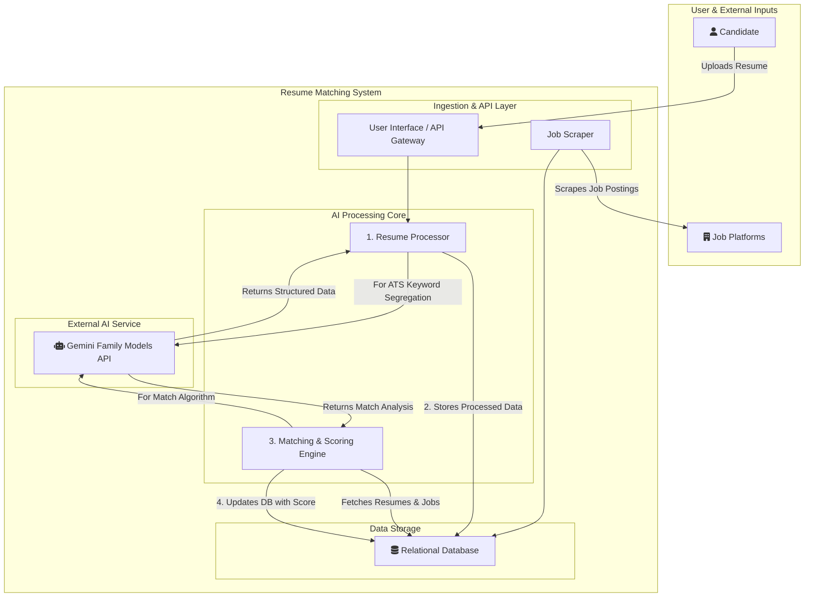

# Synapse-ATS: AI-Powered Resume & Job Matcher

**Synapse-ATS** is an intelligent system designed to automate the recruitment pipeline by matching candidate resumes with job descriptions. It leverages the power of Google's **Gemini family of models** for deep semantic understanding, parsing, and scoring, ensuring a high-quality match between talent and opportunity.

-----

## System Architecture

The high-level architecture visualizes the flow of data from ingestion to the final scoring and storage.

-----

## Features

  * **AI-Powered Resume Parsing:** Extracts skills, experience, and education using the Gemini API.
  * **Automated Job Scraping:** Gathers job descriptions from various online platforms.
  * **Intelligent Matching & Scoring:** Calculates a compatibility score between each resume and job posting.
  * **RESTful API:** Provides endpoints for uploading resumes and retrieving matched results.

-----

## Tech Stack

  * **Backend:** Python (FastAPI)
  * **Database:** PostgreSQL
  * **AI Model:** Google Gemini API

-----
